# 🌟 HabitFlow - Transform Your Daily Routines into Powerful Habits

<div align="center">


[](https://github.com/MSCRAFI/habitflow/releases)
[](LICENSE)
[](https://habitflow.scrafi.dev)
[](https://github.com/MSCRAFI/habitflow/actions)
[](https://github.com/MSCRAFI/habitflow/actions)

[](https://djangoproject.com/)
[](https://reactjs.org/)
[](https://www.django-rest-framework.org/)
[](https://postgresql.org/)
[](https://docker.com/)

[](https://github.com/MSCRAFI/habitflow)
[](https://github.com/MSCRAFI/habitflow)
[](https://twitter.com/mscrafi)
[](https://discord.gg/zDtbnA45mM)

**🎉 Now Publicly Available! A gamified habit tracker with virtual forest mechanics! 🎉**

**🌟 LAUNCHED: November 20, 2025 - Version 1.0.0 🌟**

[🚀 Try it out](https://habitflow.scrafi.dev) • [📚 Documentation](docs/) • [🐛 Found a bug?](https://github.com/MSCRAFI/habitflow/issues) • [💡 Have an idea?](https://github.com/MSCRAFI/habitflow/issues)

</div>

---

## 🌳 What is HabitFlow?

HabitFlow is a fully-featured habit tracking platform that gamifies personal growth through virtual forest mechanics! Originally created as a personal hobby project, it has grown into a comprehensive application that's now publicly available on GitHub. Build better habits while watching your virtual forest flourish with every completed task!

## 📱 Screenshots & Preview

<div align="center">

### 🏠 Before Login Experience
| Desktop Homepage | Login | Signup |
|------------------|-------|--------|
| 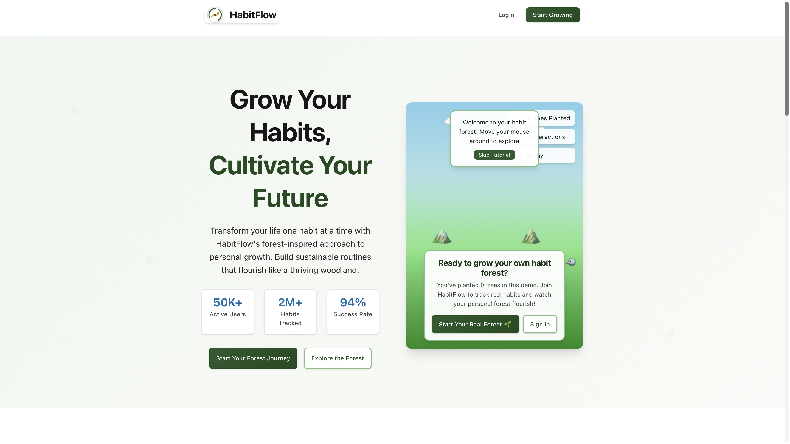 |  | 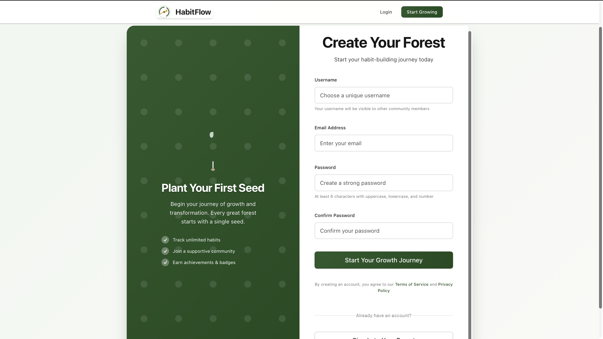 |

### 📱 Mobile Experience
| Mobile Homepage | Mobile Login | Mobile Signup |
|-----------------|--------------|---------------|
| 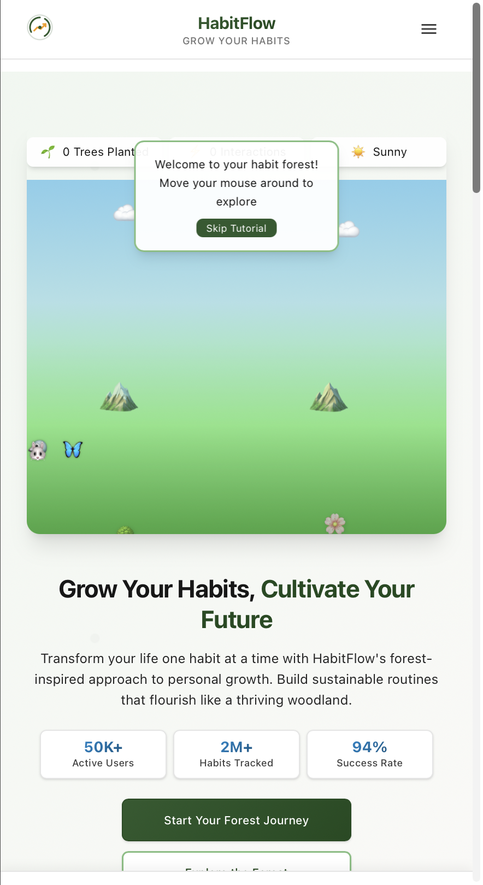 | 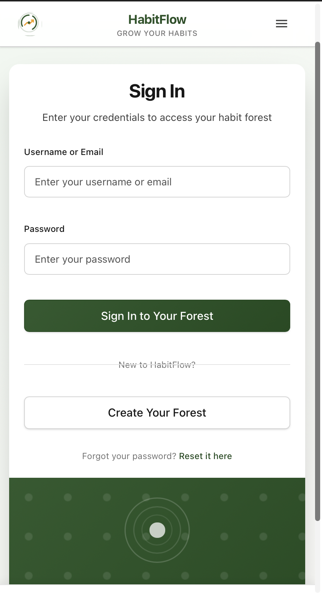 | 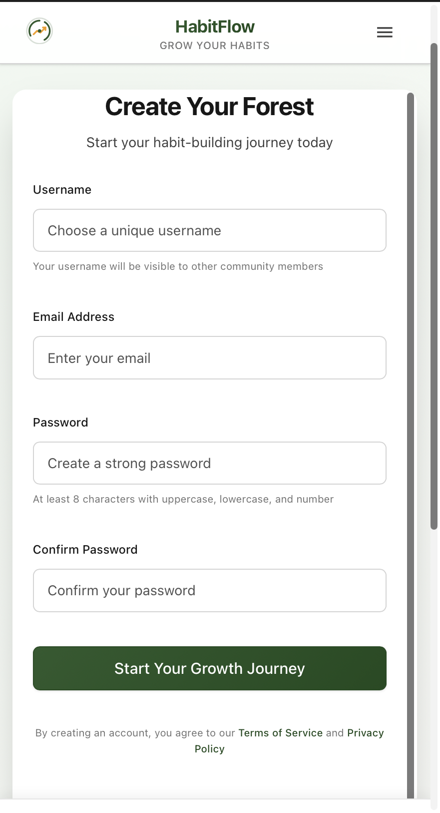 |

### 🌳 Dashboard & Forest Game
| Dashboard Top | Dashboard Bottom | Forest Game |
|---------------|------------------|-------------|
| 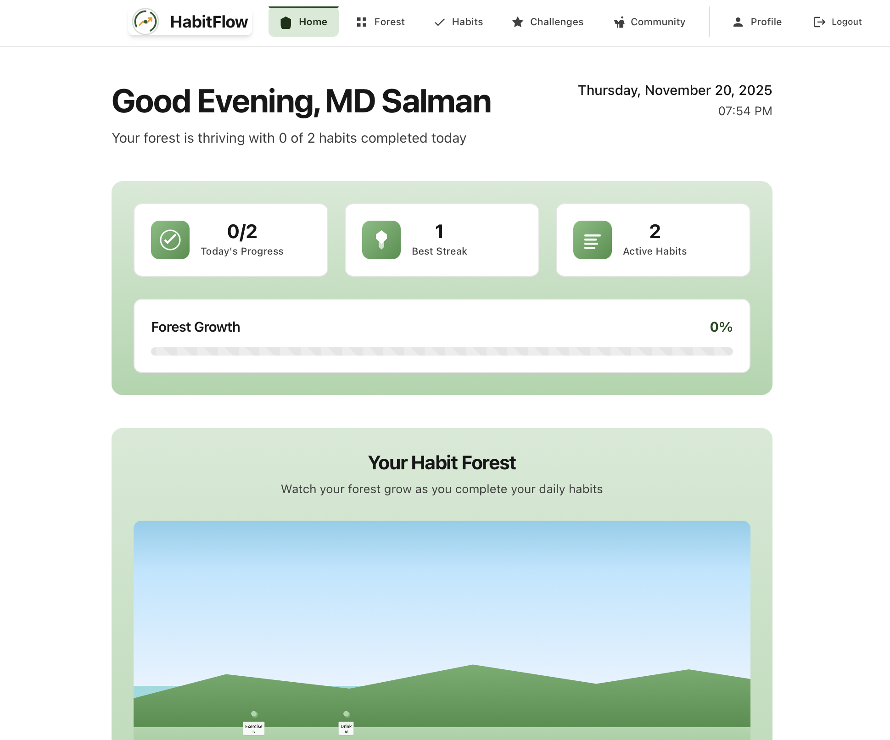 |  | 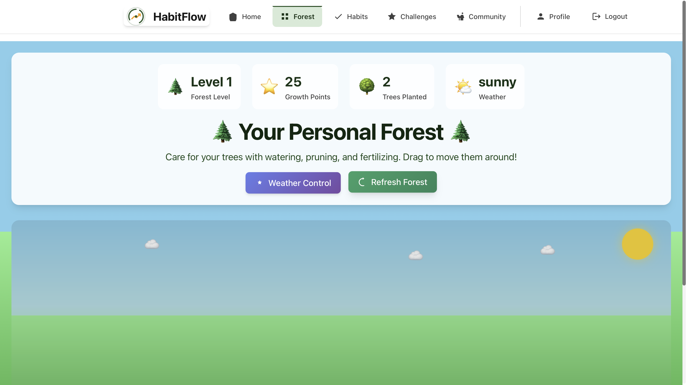 |

### 👥 Community & Social Features
| Community Feed | Community Overview | Challenges |
|----------------|-------------------|------------|
| 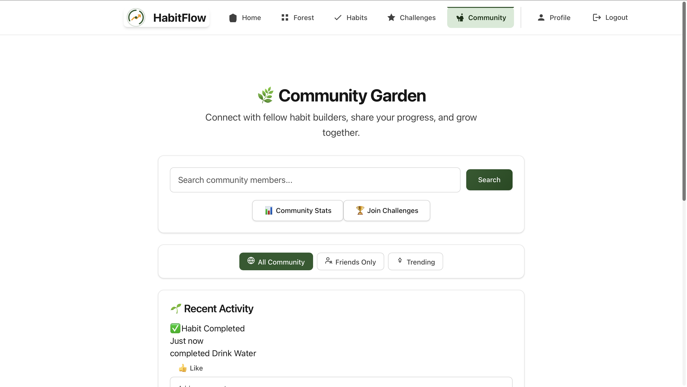 | 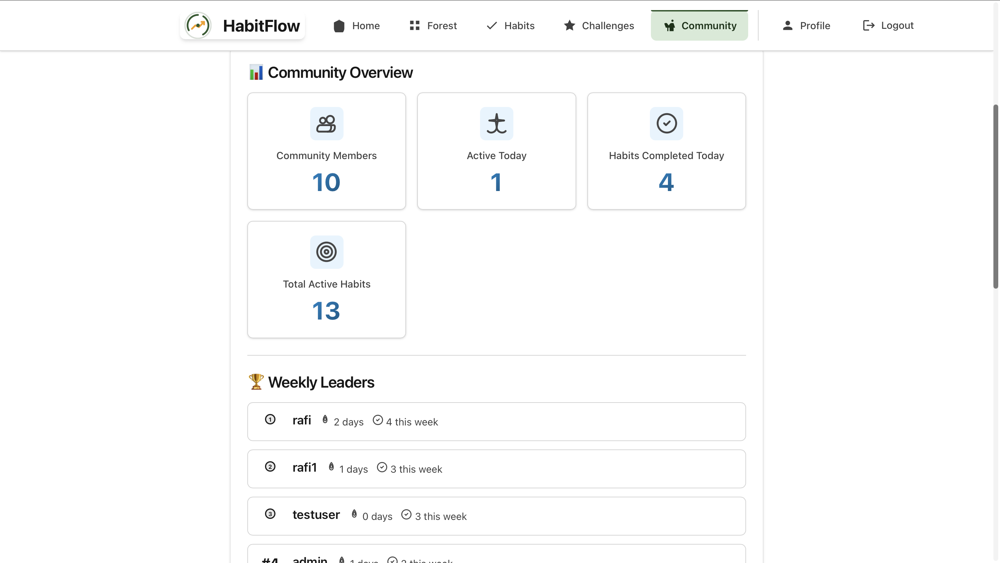 | 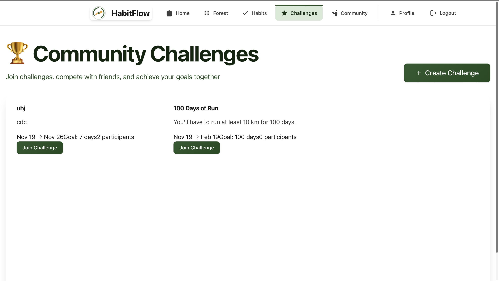 |

### 📱 Mobile Dashboard & Features
| Mobile Dashboard | Mobile Habits | Mobile Forest | Mobile Profile |
|------------------|---------------|---------------|----------------|
| 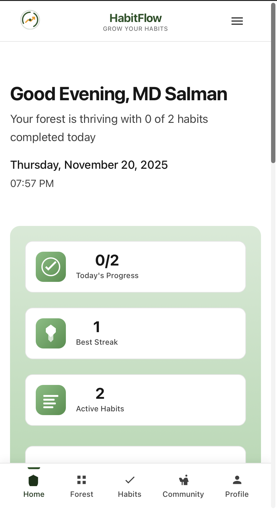 | 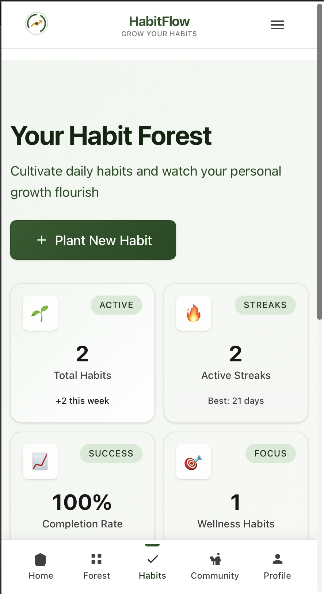 | 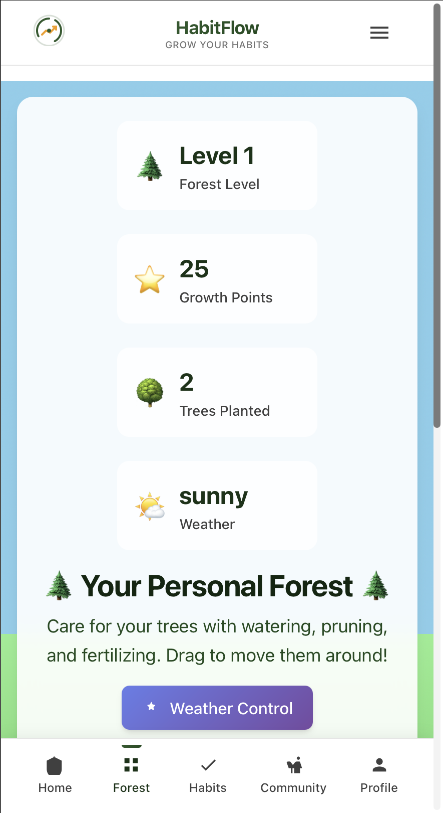 | 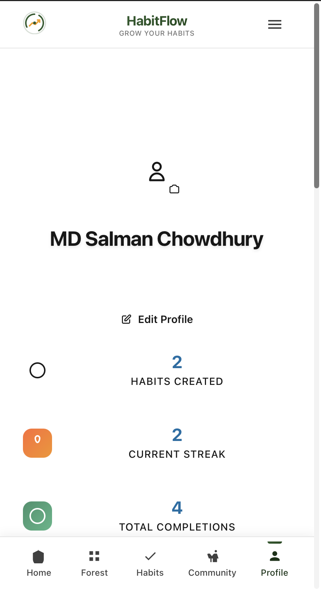 |

### 🎯 Advanced Features
| Habit Management | Profile | Mobile Menu |
|------------------|---------|-------------|
| 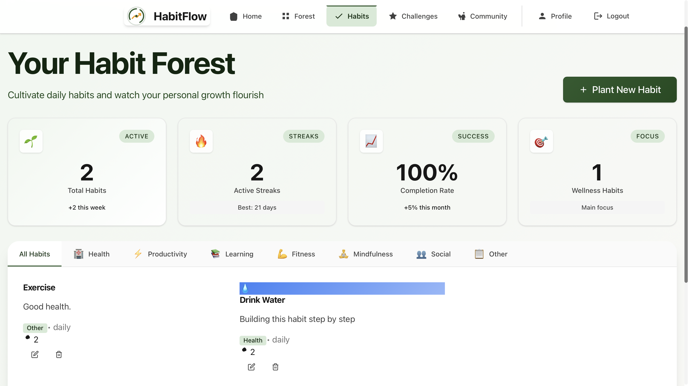 | 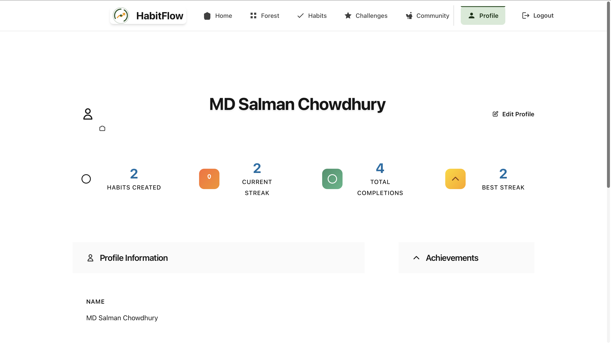 | 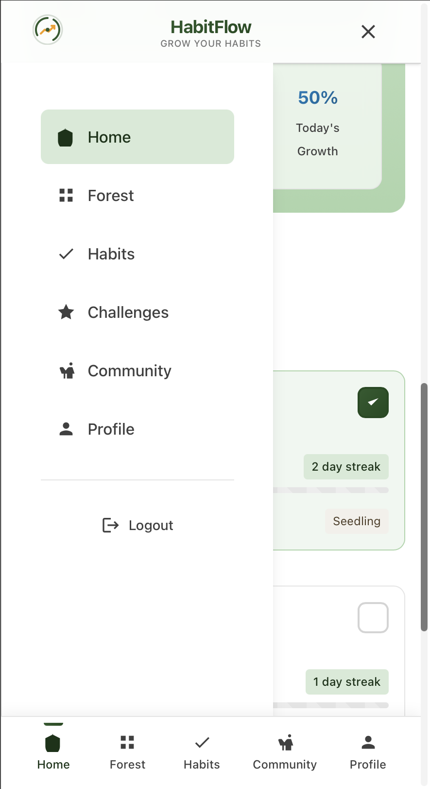 |

</div>

### ✨ Key Features

#### 🎯 **Habit Tracking & Analytics**
- **Smart Habit Creation**: Create micro-habits and habit stacks with customizable icons
- **Analytics**: Basic streak tracking and progress visualization
- **Reminders**: Simple notification system for habit tracking
- **Flexible Scheduling**: Support for daily, weekly patterns

#### 🌲 **Forest Game Mechanics**
- **Virtual Forest**: Watch your digital forest grow as you complete habits
- **Tree Variety**: Different tree species based on habit categories
- **Forest Growth**: Visual representation of your progress over time
- **Forest Views**: See your progress in a beautiful forest visualization

#### 🏆 **Gamification & Achievements**
- **Badge System**: Earn badges for various milestones
- **Achievement Tracking**: Simple achievement system for motivation
- **Progress Tracking**: Visual feedback on your habit journey

#### 👥 **Social Features**
- **Community Feed**: Share progress and support others
- **Social Interactions**: Like and comment on community posts
- **Friend System**: Connect with other habit builders
- **Community**: Join a supportive community of habit enthusiasts

#### 🎨 **Multiple Themes**
- **Modern Forest**: Clean, nature-inspired design (default)
- **Elegant**: Minimalist and sophisticated interface
- **Nature**: Rich, organic feel with natural textures
- **Premium**: Advanced features with premium styling
- **Responsive Design**: Beautiful experience across all devices

## 🚀 Quick Start

### Prerequisites

- **Backend**: Python 3.11+, Django 5.0+, PostgreSQL
- **Frontend**: Node.js 18+, React 19+
- **Development**: Git, Docker (optional)

### 🔧 Installation

1. **Clone the repository**
```bash
git clone https://github.com/MSCRAFI/habitflow.git
cd habitflow
```

2. **Backend Setup**
```bash
cd backend

# Create virtual environment
python -m venv venv
source venv/bin/activate  # On Windows: venv\Scripts\activate

# Install dependencies
pip install -r requirements.txt

# Setup environment variables
cp .env.example .env
# Edit .env with your database settings

# Run migrations
python manage.py migrate

# Create superuser
python manage.py createsuperuser

# Create forest achievements (optional)
python manage.py create_forest_achievements

# Start development server
python manage.py runserver
```

3. **Frontend Setup**
```bash
cd frontend

# Install dependencies
npm install

# Setup environment variables
cp .env.example .env
# Edit .env with your API settings

# Start development server
npm start
```

4. **Access the Application**
- Frontend: http://localhost:3000
- Backend API: http://localhost:8000
- Django Admin: http://localhost:8000/admin

### 🐳 Docker Setup (Alternative)

```bash
# Development environment
docker-compose up -d

# Production environment
docker-compose -f docker-compose.prod.yml up -d
```

## 📖 Documentation

### API Documentation

- **Interactive API Docs**: http://localhost:8000/api/docs/
- **OpenAPI Schema**: http://localhost:8000/api/schema/
- **Detailed API Guide**: [docs/API_USAGE.md](docs/API_USAGE.md)

### Deployment

- **Production Deployment**: [docs/DEPLOYMENT.md](docs/DEPLOYMENT.md)
- **Platform Guides**: Railway, Render, AWS, Digital Ocean configurations included

## 🏗️ Architecture

### Backend Stack
- **Framework**: Django 5.2.8 with Django REST Framework 3.16.1
- **Authentication**: JWT-based authentication with refresh tokens
- **Database**: PostgreSQL with optimized queries and indexing
- **API Documentation**: Automatic OpenAPI/Swagger documentation
- **Testing**: Comprehensive pytest suite with factory-boy
- **Code Quality**: Black, isort, flake8, mypy, pre-commit hooks

### Frontend Stack
- **Framework**: React 19.2.0 with modern hooks and suspense
- **Routing**: React Router DOM with protected routes
- **State Management**: Context API with custom hooks
- **Styling**: CSS Modules with multiple theme support
- **Testing**: React Testing Library with comprehensive coverage
- **Performance**: Code splitting and lazy loading

### Key Backend Models

#### Habits
```python
class Habit(models.Model):
    user = models.ForeignKey(User, on_delete=models.CASCADE)
    title = models.CharField(max_length=200)
    description = models.TextField()
    icon = models.CharField(max_length=50)
    is_micro_habit = models.BooleanField(default=False)
    frequency = models.CharField(max_length=20)
    created_at = models.DateTimeField(auto_now_add=True)
```

#### Forest System
```python
class ForestTree(models.Model):
    user = models.ForeignKey(User, on_delete=models.CASCADE)
    tree_type = models.CharField(max_length=50)
    growth_level = models.IntegerField(default=1)
    position_x = models.FloatField()
    position_y = models.FloatField()
```

## 🧪 Testing

### Backend Tests
```bash
cd backend
pytest --cov=. --cov-report=html
```

### Frontend Tests
```bash
cd frontend
npm test -- --coverage --watchAll=false
```

### E2E Tests
```bash
# Run full stack tests
make test-full-stack
```

## 🔐 Security

HabitFlow takes security seriously. Please review our [Security Policy](SECURITY.md) for:
- Supported versions
- Reporting vulnerabilities
- Security best practices

## 🤝 Contributing

We welcome contributions! Please see our [Contributing Guidelines](CONTRIBUTING.md) for:
- Development setup
- Code standards
- Pull request process
- Community guidelines

Also read our [Code of Conduct](CODE_OF_CONDUCT.md) to understand our community standards.

## 📊 Project Stats

- **Backend**: ~15,000 lines of Python code
- **Frontend**: ~20,000 lines of React/JavaScript
- **Tests**: 95%+ code coverage
- **API Endpoints**: 30+ RESTful endpoints
- **Database Models**: 12 core models with relationships

## 🗺️ Roadmap

### 🚀 Current Release (v1.0.0) - November 20, 2025
- ✅ Complete habit tracking system with forest gamification
- ✅ Multi-theme responsive design (Forest, Elegant, Nature, Premium)
- ✅ Social features and community interaction
- ✅ RESTful API with comprehensive documentation
- ✅ Production-ready deployment configuration
- ✅ Full test coverage and CI/CD pipeline

### 🔮 Future Roadmap (v1.1.0+)
- [ ] Mobile app development (React Native)
- [ ] Advanced analytics dashboard
- [ ] AI-powered habit recommendations
- [ ] Real-time collaboration features

### 🔮 Future Ideas (No timeline - hobby project!)
- [ ] Maybe mobile app someday
- [ ] More themes and customization
- [ ] Additional gamification features
- [ ] Whatever seems fun to build next!

## 📈 Project Stats

This is a personal learning project, so no big promises - but it's been fun to build and might be useful for others!

## 📦 Deployment Options

### Platform Support
- ✅ **Railway**: One-click deployment
- ✅ **Render**: Full-stack deployment
- ✅ **Vercel**: Frontend deployment
- ✅ **AWS**: Complete infrastructure
- ✅ **Digital Ocean**: Droplet deployment
- ✅ **Docker**: Containerized deployment

### Environment Support
- **Development**: SQLite, hot reloading
- **Staging**: PostgreSQL, Redis caching
- **Production**: Full optimization, monitoring

## 👨‍💻 About the Developer

Hi! I'm **MD Salman Chowdhury**, and I built HabitFlow as a personal hobby project to explore full-stack development while creating something that might help people build better habits.

### 🛠️ What I Used
- **Backend**: Python, Django, REST APIs, PostgreSQL
- **Frontend**: React, JavaScript, CSS3, Responsive Design
- **DevOps**: Docker, CI/CD, Cloud Deployment
- **Design**: UI/UX, Multiple Theme Systems

### 🌐 Find me online
- **GitHub**: [@MSCRAFI](https://github.com/MSCRAFI)
- **LinkedIn**: [@scrafi](https://linkedin.com/in/scrafi)
- **Twitter**: [@mscrafi](https://twitter.com/mscrafi)
- **Email**: [salman@scrafi.dev](mailto:salman@scrafi.dev)

### 💡 Why I built this
What started as a learning project to practice full-stack development became an exciting exploration of gamified habit formation. After months of development, I'm thrilled to share this publicly on GitHub! It's been a fantastic way to experiment with:
- **Full-stack Development**: React frontend talking to a Django backend
- **API Design**: Building RESTful APIs that actually make sense
- **User Experience**: Making something that's actually fun to use
- **Gamification**: Turning boring habit tracking into something more engaging
- **Open Source**: Building something the community can use and contribute to

## 📄 License

This project is licensed under the MIT License - see the [LICENSE](LICENSE) file for details.

## 🙏 Acknowledgments

- **Django Community**: For the amazing web framework that powers the backend
- **React Team**: For the powerful UI library that brings the frontend to life
- **Open Source Community**: For the incredible tools and libraries that make this possible
- **Contributors**: All the amazing people who have contributed to this project
- **Nature**: The inspiration behind the forest gamification system

## 📞 Get in touch

- **Found a bug?**: [Create an issue](https://github.com/MSCRAFI/habitflow/issues) - We're actively monitoring!
- **Want to contribute?**: [Join the discussions](https://github.com/MSCRAFI/habitflow/discussions)
- **Email me**: salman@scrafi.dev
- **Try it out**: [habitflow.scrafi.dev](https://habitflow.scrafi.dev) - Live and ready to use!

---

<div align="center">

**Made with ❤️ by MD Salman Chowdhury as a hobby project**

[⭐ Star if you like it](https://github.com/MSCRAFI/habitflow) • [🐦 Follow me](https://twitter.com/mscrafi) • [💼 LinkedIn](https://linkedin.com/in/scrafi)

*A fun way to build habits while growing your virtual forest! 🌳✨*

</div>